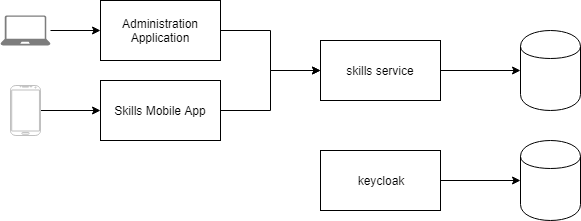

# Architecture Documentation
This documentation is based on [arc42](https://arc42.org/download).

## Introduction and Goals
### Requirements Overview
See [Trello board](https://trello.com/b/cTCQho4q/ysg-manager-skills) with requirements for skills management.

**Player creation**
* Players are created in Administration Application (number, name, skater / goaltender). In future, team coaches can create the players at their own.
* Players will be suggested on Skills Mobile App.
* Skills Mobile App Users need to be able to add a player which doesn't yet exist.
* Skills Mobile App Users don't fill in player names. If player is created on mobile app, it's name needs to be appended in Administration Application 

### Quality Goals
### Stakeholders

## Architecture Constraints

## System Scope and Context
###Business Context
###Technical Context
System context diagram:

## Solution Strategy
### Skills Mobile App: Offline Solution Strategy
* save records in IndexedDB
* set it dirty after creation, when update fails and when record is updated
* web worker which continuously tries to send records to the skills service, removes dirty mark when successful
* provide button 'upload now'
* provide feature 'export to clipboard' for emergency cases (e.g. upload fails or skills service is not available). Data can then be sent by e-mail and imported to the administration application later.

## Building Block View

### Class Diagram

## Runtime View

## Deployment View

## Cross-cutting Concepts

## Design Decisions

### Technology for Skills Mobile App
Which technology should be used for the application which is used to collect the skill results on mobile devices?

**Preconditions**
* Installation on devices of users (skill chefs and skill experts) needs to be done fast and easy.

**Progressive Web App (PWA)**
* (+) independent of mobile OS
* (+) doesn't need to be installed by transferring an artifact to the device
* (+) independent of app stores
* (-) no access to files
* (-) limited features. See [What Web Can Do Today](https://whatwebcando.today).

**Native App**
* (+) access to native resources (e.g. file system)
* (-) mac computer needed to build an iOS app
* (-) separate artifacts needed for separate mobile OS's
* (-) needs to be installed by transferring artifact to device (by app store or by connecting device to computer)

**Desicion**: PWA. Features of PWAs are sufficient for requirements. Installation of the app is very easy, no installation of an artifact needed. App doesn't need to be pushed to app stores. I currently don't have a mac computer.

### Identity Management
How should identity management be solved?

**Keycloak**
* (+) state of the art identity and access management system with components and features (like login form or forgot password feature) which can be used out of the box
* (+) existing know-how
* (-) increased complexity because it needs to be run as separate container
* (-) higher costs because multiple containers need to be run

**Self made with Spring Security**
* (-) error prone because it's self made
* (-) Components and features (like login form or forgot password feature) need to be developed
* (+) simple, quick to build
* (+) ysg-manager can still be run as single container, no container orchestration needed -> cheap

**Decision**: Keycloak. Powerful. Provides components and features to be used out of the box. When costs are calculated for the few days around the young star games tournament, they are quite low.

## Quality Requirements
Quality Tree
Quality Scenarios

## Risks and Technical Debts
### Risks
* entire system doesn't work -> provide empty sheets and template sheets for different skills
* upload to back end by mobile device doesn't work -> provide possibility to export skill results to clipboard (on mobile device) and import these data (e.g. sent by email) in administration application.

## Glossary
* **Skill Operator**: A skill chef or skill expert
* **Skill Chef**: Person who collects the skill results like execution time or execution failures on the ice
* **Skill Expert**: Person who rates the skill executions and collects these results on the ice
* **Skills Mobile App**: Mobile application used by skill chefs and skill experts to collect skill results.